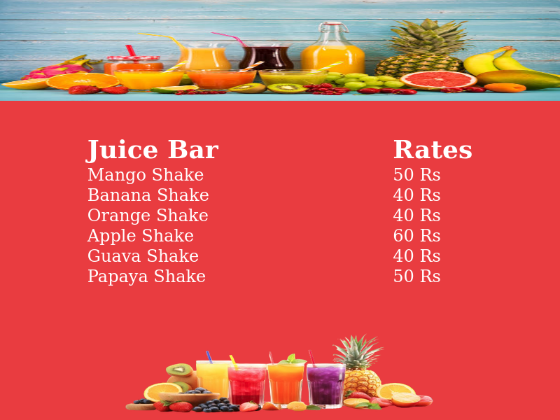
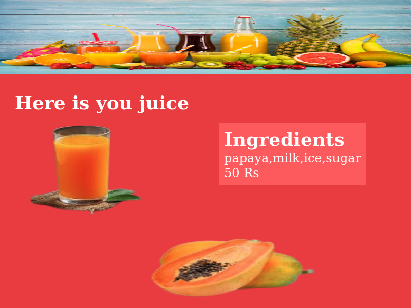

# Juice Bar App
This is HTML, CSS and Javascript based Juice bar application. 

## Tech Stack

**HTML**, **CSS**, **Javascript** **objects**

## Features
1. Fruits counter with pricing list
2. Select juice type or fruit
3. Loader while juice is under process
4. Serve the juice with ingradient list and price

# Live Url
https://narenderrajput.github.io/juice-bar/

[View Demo on youtube](https://youtu.be/C6GPfqLI1lM)

# Screenshot

# Fruit counter

# Final Output

